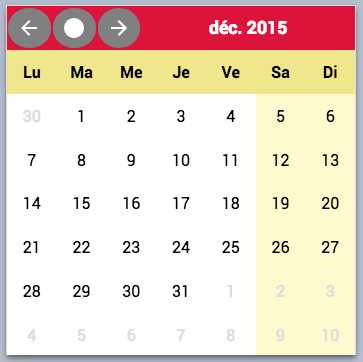

% zdkelt-calendar  
% zedesk <dev@zedesk.net>  
% September 2015

# zdkelt-calendar

A calendar component, which could be used as date-picker

Example:

    <zdkelt-calendar i18n="fr" init-date="2015-12-25"></zdkelt-calendar>

### Install

to install it in tout project

    npm install zdkelt-calendar --save

The component is based on Polymer v1.1.0

### Styling

Custom property             | Description
----------------------------|----------------------
`--zdk-calendar-select`     | style of the selected date
`--zdk-calendar-week`       | background color of the calendar
`--zdk-calendar-weekend`    | background color for week-end days
`--zdk-calendar-notinmonth` | style for days not in the current month
`--zdk-calendar-title`      | style of date title bar
`--zdk-calendar-weekdays`   | style of the week days name
`--zdk-calendar-today`      | style of the today date
